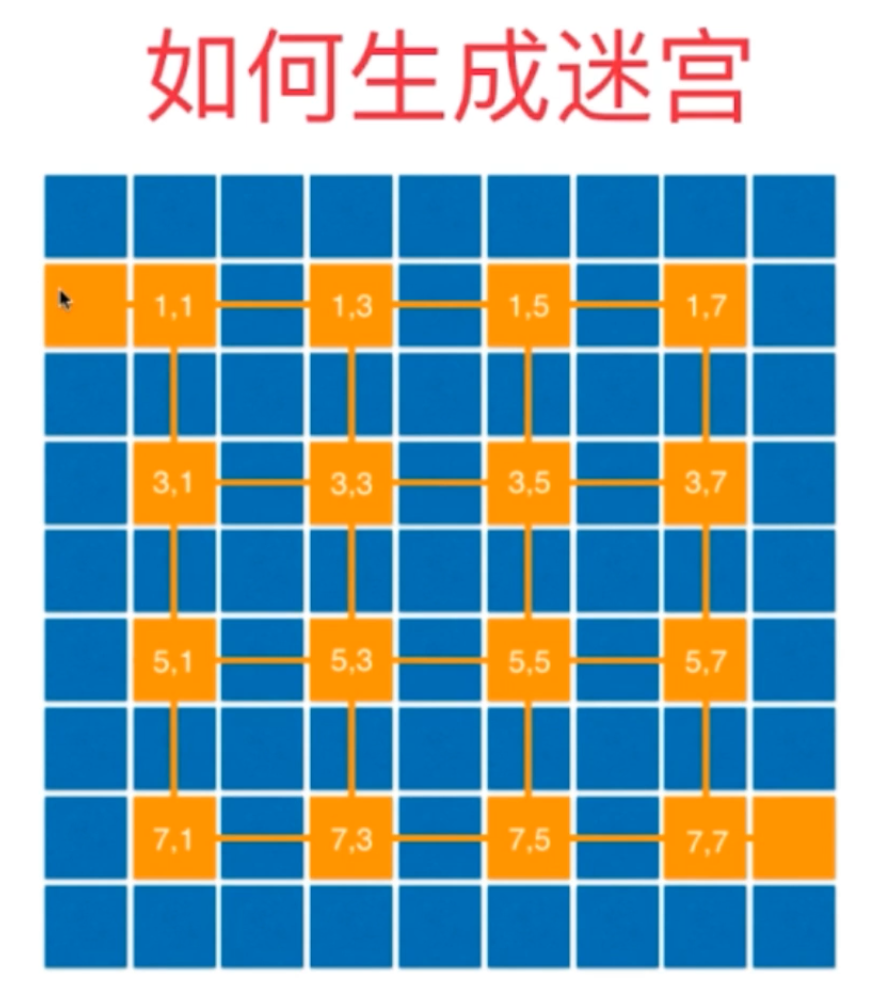

## 随机模拟问题

### 分钱问题

房间里有100个人，每个人有100块钱，他们在玩一个游戏。没轮游戏中，每个人都拿出一元前随机给另一个人，最后这100个人的财富分布是怎样的？

最后分布将是非常无序的，而非每人差不多。相当于100x100分给100个人，而每个人差不多的概率其实是小概率事件。

### 蒙特卡洛算法

蒙特卡洛方法是一种统计学的方法，是一种模拟。通过大量随机样本，去了解一个系统，进而得到所要计算的值。

#### 蒙特卡洛方法求Pi值

一个正方形，里面是一个直径和它边长相等的圆

- 圆面积 = Pi x R x R
- 方面积 = 2R x 2R
- 比一下则：Pi = 4 x 圆面积/方面积

那么不知道Pi怎么计算圆的面积呢？大可不必算，圆/方不就是落在圆中的概率么。

#### 三门问题(Monty Hall Problem)

参赛者会看见三扇关闭的门，其中一扇的后面有一辆汽车，选中后面有车的门可以赢得该汽车，而另外两扇门后面什么都没有。当参赛者选定一扇门，但开启前，节目主持人会开启剩下两扇门中的一扇，这扇门后面一定没有汽车。主持人问参赛者要不要换另一扇门。问题是：另一扇门会不会增加参赛者获奖概率？

直觉上，主持人开的门并不会影响我们，相当于1/2的命中率。但事实上:

- 换门中奖概率2/3
- 不换门中奖概率1/3

因为主持人知道哪个门没奖，而且一直选择没奖的没，因此导致了概率的不平均，产生偏差

## 迷宫问题

### 迷宫生成

抽象成计算机的概念，迷宫其实就是一棵树，迷宫生成问题就是一个随机生成树问题。

以这么的结构初始化图，再随机生成树

要随机的生成数，就需要创建一个随机队列，出队时随机选择一个元素出队。 **出队时，随机选中的元素和队尾元素交换位置，然后出队。**

#### 随机性更强的迷宫

上面的迷宫随机性不强，总体上从左上到右下，原因是每次从随机队列选出一个元素时，如果选择的元素是上个元素的最后一个元素，那么就相当于执行了一个小的深度优先遍历。而深度优先走的整体就是向下向右。

- 另一种随机队列：
    - 基于链表
    - 入队：随机入队首或队尾
    - 出队：随机从队首或队尾挑选元素

#### 更多随机方案、更多形状的迷宫

### 扫雷游戏

- 随机生成雷区
    * 方案1：随机坐标，然后在这个位置埋雷
        + 缺点：随机出的坐标可能已经有雷，如果在while中跳过已经有雷的区域，则时间将不确定，有可能每次都随机出已经有雷的区域
    * 方案2：将雷顺序放在前面的格子，然后随机交换一定次数

#### 什么样的乱序化才是好的乱序

- 问：给一副扑克牌，设计一个洗牌算法，怎么说明你的洗牌算法是个好的洗牌算法
- 54张牌，可以有54!种结果。所以一个好的洗牌算法可以等概率获得54!种结果之一

#### 等概率洗牌算法

- 方案1：根据现实模拟。54!种结果来源于第一张牌有54个位置可选，第二张53...根据这点设计洗牌算法。从54张牌中随机抽一张放在一个位置...
    * 缺点：不是原地的，即需要额外的存储空间;如果随机取牌不够随机，那也不是等概率的

#### **Fisher-Yates(-Knuth)洗牌算法** 

以洗牌为例，在长度位54的数组中随机选择一个元素，然后与第一个元素交换位置。然后以剩下的张牌位单位重复这个操作。

#### Floodfill算法

就像一滴墨水滴在白纸上，慢慢扩散，所以称floodfill。也就是要注意边界的BFS或DFS。

